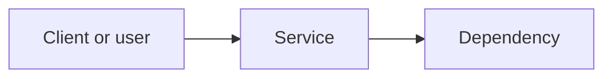

# Proposal: [service or initiative name]

**Status:** Draft | Under review | Accepted | Deferred | Rejected  
**Author:** [name]  
**Date:** [YYYY-MM-DD]

## Summary

One short paragraph: what this service is, what problem it solves, and who would use it.

## Goals and non-goals

- **Goals:** …
- **Non-goals:** …

## Architecture

Describe how this service connects to callers, data stores, identity, networks, and other dependencies.

Replace the diagram above with an accurate view (components, data flow, trust boundaries). Add notes under the diagram if needed.

## Impact if unavailable

What breaks or degrades if this service is down or severely impaired? Be explicit about blast radius (team-only vs org-wide vs external).

## Recovery when it goes down

How we detect failure, who responds, and concrete recovery steps (failover, restart, restore from backup, vendor ticket, rebuild). Link to runbooks or tickets if they exist.

## Cost to team or organization

Direct and indirect costs: subscriptions, usage fees, minimum commits, training, migration, or duplicate tooling we would retire.

## Maintenance cost for the team

Ongoing effort: upgrades, CVE handling, API drift, on-call load, operational toil, and required skills on the team.

## Alternatives considered

Brief list of other options and why this one is preferred (or trade-offs).

## Decision

Leave blank until review completes. Record the outcome and any conditions (e.g. pilot period, sunset date).
