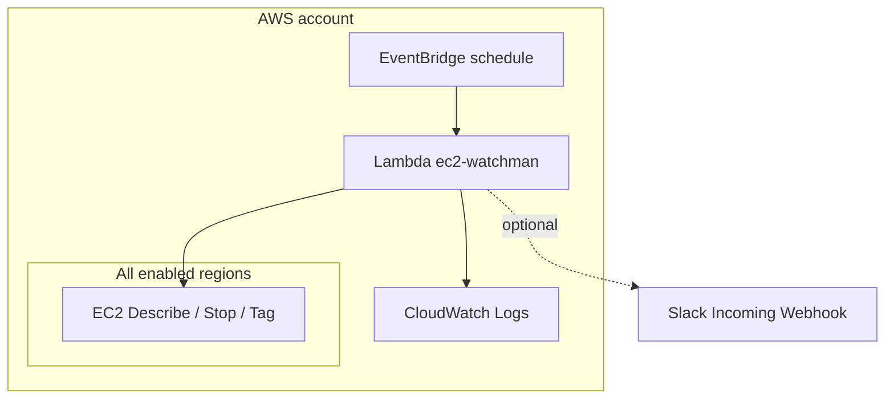

# Proposal: EC2 Watchman

**Status:** Accepted (operational; implementation lives in [`watchman/`](../watchman/))  
**Author:** eggfoobar 
**Date:** 2026-04-16

## Summary

**EC2 Watchman** is a scheduled AWS Lambda that scans **all EC2 regions** in an account, identifies running instances that exceed a configured age policy (with optional `keep-{days}` tags to extend lifetime), **stops** those instances, tags them with `watchman-stopped-at`, and optionally posts to a **Slack incoming webhook** before shutdown (for Red Hat Slack, webhooks are commonly created via the [Eddie](slack-bot-eddie.md) app). It is a cost-control and hygiene tool for shared AWS accounts where long-lived dev or test instances would otherwise run indefinitely.

Code and deployment assets: [`watchman/README.md`](../watchman/README.md), SAM template [`watchman/template.yaml`](../watchman/template.yaml).

## Goals and non-goals

- **Goals:** Automatically stop stale EC2 instances across regions; make exceptions explicit via tags; optional operator visibility via Slack; low operational surface (single Lambda + schedule + logs).
- **Non-goals:** Terminate instances or tear down CloudFormation stacks; guarantee RTO for workloads on those instances; enforce tagging policy beyond `keep-*` semantics.

## Architecture

Amazon EventBridge (schedule) invokes the Lambda in the **stack region**. The function calls EC2 APIs globally (`DescribeRegions`, then per-region `DescribeInstances` / `StopInstances` / `CreateTags`). Optional HTTPS calls to Slack use the webhook URL from Lambda environment variables.

**Trust / data:** The function’s IAM role is broad (`Resource: '*'` on EC2 actions listed in the template) because it must operate in every region. Slack receives instance id, name (if tagged), region, and age—treat the webhook URL as a secret (see [Eddie](slack-bot-eddie.md) for the Slack-side app that issues such webhooks).

## Impact if unavailable

- **Cost / hygiene:** Instances that would have been stopped continue to run; **AWS spend and quota use can increase** until someone notices and cleans up manually.
- **Policy drift:** Teams relying on Watchman for “default off” behavior lose that guardrail; nothing automatically enforces shutdown.
- **No direct user-facing outage:** Watchman does not serve traffic; workloads on EC2 keep running (which is exactly why failure increases cost risk rather than application downtime).

Slack-only failure: shutdowns still occur; operators may lose early warning.

## Recovery when it goes down

1. **Detect:** CloudWatch **Errors** / **Throttles** on the function, missing **invocations** on the schedule, or absence of expected log lines under `/aws/lambda/ec2-watchman` (see [`watchman/README.md`](../watchman/README.md#monitoring)).
2. **Diagnose:** Read recent log streams; check per-region log lines (`Error processing region …`). Common issues: IAM changes, disabled regions, timeout under very large inventories.
3. **Restore service:** Redeploy or update the CloudFormation / SAM stack from this repo (`sam build` / `sam deploy` per [`watchman/README.md`](../watchman/README.md#deployment)); confirm schedule **Enabled**, verify **SlackWebhookURL** parameter if notifications are required.
4. **Mitigate cost while broken:** Manual stops, AWS Budgets/alerts, or temporary schedules—Watchman does not replace those for critical accounts.

## Cost to team or organization

- **AWS:** Lambda invocations, duration (default 256 MB, 300 s max), and **CloudWatch Logs** (log group retention **14 days** in template). Typically **small** relative to EC2 left running.
- **Slack:** Incoming Webhooks are usually covered under existing Slack workspace terms; no separate product fee for the webhook mechanism itself.
- **Savings:** Successful runs **reduce** EC2 usage charges by stopping instances that meet the policy.

## Maintenance cost for the team

- **Runtime / dependencies:** Python 3.11 Lambda; [`watchman/requirements.txt`](../watchman/requirements.txt) includes `requests` (packaged with deployment). Occasional **runtime deprecation** requires SAM/template updates.
- **Policy alignment:** The enforced age threshold and tag rules live in [`watchman/lambda_function.py`](../watchman/lambda_function.py); changes need code review and redeploy. *(Note: top-level README mentions 24 hours; current code uses a **12-hour** default when no `keep-*` tag applies—keep docs and operator expectations in sync.)*
- **Secrets / config:** Rotate or replace Slack webhook if leaked; update stack parameters.
- **On-call:** Low if schedules and alarms exist; spikes if accounts grow very large and timeouts need tuning (see README limitations).

## Alternatives considered

- **Manual or scripted cleanup:** Flexible but inconsistent and easy to skip under time pressure.
- **AWS Instance Scheduler / Systems Manager:** First-party scheduling with different setup and cost model; may fit some orgs better for fixed windows.
- **Budgets + anomaly detection only:** Alerts without automated stop—less enforcement, lower blast radius if misconfigured.

Watchman trades **automation and coverage (all regions)** for **strong EC2 stop permissions** and the need to tag exceptions explicitly.

## Decision

**Accepted** as the repo’s standard pattern for automated EC2 lifecycle trimming in accounts where this stack is deployed. Revisit if AWS introduces conflicting org-wide policies or if stop-only semantics are insufficient (e.g. mandatory terminate + stack cleanup).
