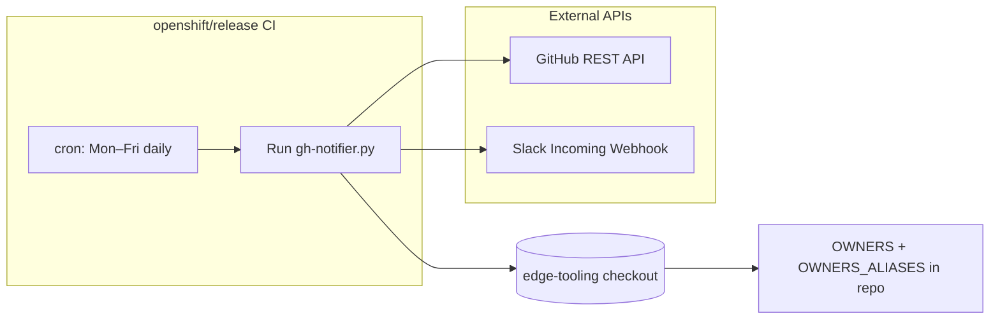

# Proposal: GitHub PR notifier (`gh-notifier`)

**Status:** Accepted (implementation in [`gh-notifier/gh-notifier.py`](../gh-notifier/gh-notifier.py); **openshift/release** supplies schedule and secrets; **approver/alias source files** are **[`OWNERS`](../OWNERS) and [`OWNERS_ALIASES`](../OWNERS_ALIASES) in this repo**, not in openshift/release)
**Author:** eggfoobar
**Date:** 2026-04-16

## Summary

**gh-notifier** is a small, dependency-free Python script that uses the **GitHub REST API** to list **open pull requests** in one or more repositories, filters them (authors, drafts, labels), flags PRs that **need attention** (stale `updated_at` / `created_at`, optional required or forbidden labels), and posts a **Slack Block Kit** summary via an **Incoming Webhook** (same class of integration as [Eddie](slack-bot-eddie.md)).

**Repository layout:** Source of truth for the script is this repo under [`gh-notifier/`](../gh-notifier/). **openshift/release** is expected to invoke it **once per day, Monday through Friday**, with a checkout of **edge-tooling** so the notifier can read **[`OWNERS`](../OWNERS)** and **[`OWNERS_ALIASES`](../OWNERS_ALIASES)** from **this repository** to determine which GitHub logins count as “our” PR authors. **openshift/release does not host those files**—only the job wiring, credentials, and schedule live there.

The script loads **[`OWNERS`](../OWNERS)** and **[`OWNERS_ALIASES`](../OWNERS_ALIASES)** from the checkout (default paths are the repo root next to `gh-notifier/`) and expands **approvers** and **reviewers** entries (including aliases such as `edge-approvers` → individual GitHub logins).

## Goals and non-goals

- **Goals:** Give maintainers a **single Slack digest** of open PRs that may be stuck or violate label rules; keep logic in **edge-tooling** for review and reuse; avoid extra Python dependencies (`urllib` only).
- **Non-goals:** Replace GitHub notifications, CODEOWNERS, or merge automation; maintain duplicate approver/alias lists under openshift/release (single source of truth stays in edge-tooling); page on every open PR (only “needs attention” rows are highlighted, with a cap in Slack).

## Architecture

A scheduled job in **openshift/release** (weekdays only) checks out **edge-tooling**, runs `gh-notifier.py` from that tree, and injects secrets from CI (token, Slack webhook, optional repo list and label tuning):

- **`GITHUB_TOKEN`** — API access (minimum scopes to read pulls on the target repos).
- **Author allowlist** — built inside the script from **[`OWNERS`](../OWNERS)** and **[`OWNERS_ALIASES`](../OWNERS_ALIASES)** in the **edge-tooling** clone (override file locations with **`OWNERS_FILE`** / **`OWNERS_ALIASES_FILE`** if needed), **not** from files in openshift/release.
- **`SLACK_WEBHOOK_URL`** — channel webhook (often from [Eddie](slack-bot-eddie.md)).
- Optional: **`GITHUB_REPOS`**, **`STALE_DAYS`**, **`EXCLUDE_LABELS`**, **`REQUIRED_LABELS`**, **`FORBIDDEN_LABELS`** (see [`gh-notifier.py`](../gh-notifier/gh-notifier.py)).

**Trust / data:** The token can read private repo metadata depending on token type; the Slack webhook is a **secret**; message bodies include PR titles, authors, and links visible in the channel.

## Impact if unavailable

- **Process:** Maintainers lose the **automated daily Slack digest**; open PRs still exist in GitHub and other notifications (email, GitHub UI) are unchanged.
- **Risk:** Stale or mislabeled PRs may be noticed **later**, increasing queue time or duplicate work—not a production outage for shipped clusters.
- **If GitHub token fails:** Script exits with error; no Slack post (when webhook posting is enabled).
- **If Slack fails:** GitHub data may still be printed to CI logs when `SLACK_WEBHOOK_URL` is unset and there are attention items; with webhook set, Slack errors surface as job failure depending on how release wraps the script.

## Recovery when it goes down

1. **openshift/release:** Inspect the failing periodic job logs; confirm schedule (Mon–Fri), image or checkout path to `gh-notifier.py`, and injected env vars.
2. **GitHub:** Rotate or fix `GITHUB_TOKEN` (expiry, org SSO, missing `repo` read scope as required).
3. **Author list:** Update **[`OWNERS`](../OWNERS)** / **[`OWNERS_ALIASES`](../OWNERS_ALIASES)** in **edge-tooling** if membership changed; confirm the job uses a fresh checkout; ensure resolved logins match `user.login` case-insensitively as implemented.
4. **Slack:** Validate webhook URL and [Eddie](slack-bot-eddie.md) app health; rotate URL in release secrets if revoked.
5. **Rerun:** Manually trigger the release periodic or run the script locally with the same env for debugging.

## Cost to team or organization

- **GitHub:** Routine list-pulls usage against rate limits; **daily** cadence is typically negligible for a small set of repos.
- **Slack:** Covered under Red Hat Slack; webhook path same as other automation.
- **CI:** One openshift/release job execution per weekday; cost is dominated by **release** pool policy, not this script’s runtime.

## Maintenance cost for the team

- **edge-tooling:** Adjust filters (`STALE_DAYS`, label env vars), Slack block layout, or caps (`MAX_PRS_IN_MESSAGE`) in [`gh-notifier.py`](../gh-notifier/gh-notifier.py); keep **[`OWNERS`](../OWNERS)** and **[`OWNERS_ALIASES`](../OWNERS_ALIASES)** accurate for who receives digest coverage; code review + merge; release job picks up new commit when it pins to branch or updates ref.
- **openshift/release:** Maintain cron, secrets, and checkout/run of edge-tooling only—**not** a parallel copy of alias data.
- **API drift:** Rare GitHub API pagination or field changes; Slack Block Kit limits already chunked in code.

## Alternatives considered

- **GitHub-only reminders / saved searches:** No Slack aggregation; higher manual load.
- **Dedicated SaaS (Pull Panda, etc.):** Extra vendor and data policy review.
- **Prow / tide-only workflows:** Strong for merge gates; weaker for “human nudge” digests across arbitrary label rules.

## Decision

**Accepted.** Keep **`gh-notifier`** in **edge-tooling**; run it from **openshift/release** on a **weekday daily** schedule with a checkout of this repo so **[`OWNERS`](../OWNERS)** and **[`OWNERS_ALIASES`](../OWNERS_ALIASES)** are read **here**, not from openshift/release. Coordinate webhook lifecycle with [Eddie](slack-bot-eddie.md). Revisit if the team standardizes on a different notification platform or if GitHub Projects replace this digest.
