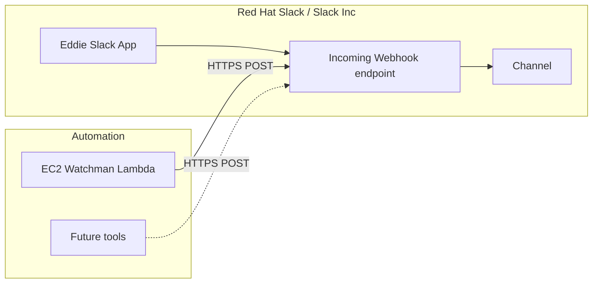

# Proposal: Slack app “Eddie” (notification webhooks)

**Status:** Accepted (operational; managed in Slack API / workspace admin, not deployed from this repo)  
**Author:** eggfoobar 
**Date:** 2026-04-16

## Summary

**Eddie** is a **Slack app** on the **Red Hat Slack** workspace whose main purpose is to let the team **create and manage Incoming Webhooks** (and related configuration) so automation can post notifications to channels without building a full Slack bot for every use case. Downstream tools hold the webhook URL as a secret and POST JSON payloads Slack accepts.

Slack app management UI: [Eddie — Slack API app](https://api.slack.com/apps/A0A9S7P1SQ4).

**Known consumers in this repo:** [EC2 Watchman](ec2-watchman.md) optionally sends shutdown notices to a webhook URL supplied at deploy time; [gh-notifier](gh-notifier.md) posts PR digests from CI using `SLACK_WEBHOOK_URL`. Both can use webhooks issued through Eddie.

## Goals and non-goals

- **Goals:** Centralize a supported pattern for **org-approved** notification webhooks on Red Hat Slack; reuse one app for multiple channels or integrations as needed; keep surface area smaller than per-tool custom Slack apps where possible.
- **Non-goals:** Replace Slack’s full messaging or workflow products; store business data inside the app; act as the identity provider for other systems.

## Architecture

Callers are **external HTTPS clients** (e.g. AWS Lambda, CI jobs, other services). They use a **channel-specific Incoming Webhook URL** generated in the Slack app configuration. Slack hosts ingestion and delivery to the configured channel.

**Trust / data:** Webhook URLs are **bearer secrets**; anyone with the URL can post to the channel (within Slack rate limits and workspace rules). Payloads should avoid secrets; treat posted content as visible to channel members. App ownership and distribution follow **Red Hat Slack** admin policies.

## Impact if unavailable

- **Notifications:** New webhook creation or rotation may be blocked; **existing webhook URLs may keep working** until revoked or the app is disabled—behavior depends on Slack and workspace admin actions.
- **Operators:** Tools such as [EC2 Watchman](ec2-watchman.md) lose **Slack visibility**; they typically **keep running** (Watchman still stops instances; only optional Slack calls fail).
- **No application runtime dependency:** Eddie is not in the request path for workloads on EC2 or OpenShift; impact is **alerting and human awareness**, not service uptime for end users.

## Recovery when it goes down

1. **Clarify scope:** Distinguish **Slack platform outage** (see [Slack status](https://status.slack.com/)), **workspace policy change**, **app disabled**, or **single webhook URL revoked**.
2. **Slack admin / app owner:** Use [the Eddie app console](https://api.slack.com/apps/A0A9S7P1SQ4) to verify the app is installed, permissions are valid, and Incoming Webhooks are enabled for the workspace.
3. **Rotate or recreate webhooks:** Generate a new Incoming Webhook URL if the old one leaked or was removed; update every consumer (e.g. Watchman `SlackWebhookURL` CloudFormation parameter) and redeploy or update the stack.
4. **Fallback:** Rely on CloudWatch logs, email, or PagerDuty until Slack path is healthy—documented per consumer.

## Cost to team or organization

- **Slack:** Covered under the organization’s **Red Hat Slack** workspace; Incoming Webhooks do not add a separate Slack SKU in the usual model.
- **Engineering time:** Initial app setup and occasional webhook rotation or channel changes.

## Maintenance cost for the team

- **Slack API / product changes:** Incoming Webhook behavior and admin UI evolve; rare breaking changes require checking payloads and app settings.
- **Security:** Webhook URL rotation after leaks; principle of least privilege on which channels Eddie may post to; periodic review of **who can manage** the app in [api.slack.com](https://api.slack.com/apps/A0A9S7P1SQ4).
- **Governance:** Workspace admins may require app re-approval or manifest updates; keep a short list of **approved consumers** (e.g. Watchman) in team docs or this proposals folder.

## Alternatives considered

- **One-off Slack app per integration:** Maximum isolation; more admin overhead and app sprawl.
- **Slack Workflow Builder / other first-party features:** Good for human-initiated flows; less ideal for simple machine POST from arbitrary AWS accounts.
- **Non-Slack channels (email only, PagerDuty, etc.):** Often better for paging; Eddie optimizes for **Slack-native** team visibility.

## Decision

**Accepted.** Eddie is the supported Slack-side pattern for Red Hat–hosted **notification webhooks** used by repo automation such as [EC2 Watchman](ec2-watchman.md). Revisit if Slack deprecates Incoming Webhooks or workspace policy mandates a different integration model.
